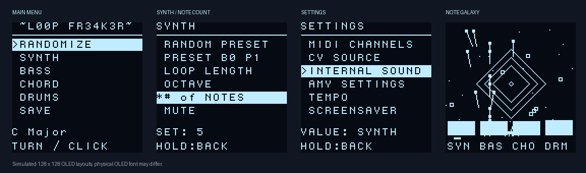

# AMYboard MIDI looper

`sketch.py` now starts the OLED sequencer after the existing four-second
hold-button recovery window. It returns to the firmware rather than entering
the old blocking menu loop, so the serial REPL remains available.

The musical generators are ported from
[racompton/midi-generator](https://github.com/racompton/midi-generator/blob/main/midi_looper.py),
source blob `0fa04f2d690f1e444bb839adbad824cc09a43158`. The port retains the
scales, weighted loop lengths, chord voicing/reharmonization, bass passing notes,
drum probabilities, and two-note synth edits. Desktop `mido`, terminal input,
threads, and sleeps are replaced with AMYboard interfaces.



[Animated screensaver preview](assets/looper-screensaver.gif). These previews run
the actual menu/animation code with a simulated display and approximate font.
[BAM! effect preview](assets/looper-bam.png).
[LOAD match preview](assets/looper-load.png).
[DRUM ROLL menu preview](assets/looper-drum-roll.png).

## Install

Use current AMYboard firmware with `amyboard.encoder()`, `amyboard.cv_out()`,
and `sequencer.TulipSequence`. The API references used for this port are
[amyboard.py](https://github.com/shorepine/tulipcc/blob/main/tulip/shared/amyboard-py/amyboard.py),
and [sequencer.py](https://github.com/shorepine/tulipcc/blob/main/tulip/shared/py/sequencer.py).

Back up `/user/current/` before replacing files. Copy these files together to
`/user/current/`, copying `sketch.py` last:

```text
loop_random.py          MicroPython random helpers
loop_patterns.py        original musical generators
loop_engine.py          note, channel, mute and CV logic
loop_sets.py            persistent named loop sets
loop_preset_preferences.py  persistent channel-specific MIDI preset choices
loop_ui.py              encoder gestures, menus, note galaxy
loop_hardware.py        MIDI and CV output
sequencer_app.py        firmware callbacks and application lifetime
sketch.py               boot entry point and recovery window
```

Older `menu.py`, `loop_amy_settings.py`, and `perf_config.json` files may remain
on the board for rollback, but the looper no longer imports them or plays AMY
internal audio. No `mido`, desktop Python packages or additional OLED driver
files are needed on the board.
The display uses AMYboard's SSD1327/SH1107 support; the encoder uses the unified
accessory API. MIDI OUT retains the board's configured TRS A/B mode.

After copying, reset the board. Hold the encoder button during the recovery
window to skip the sequencer. From the REPL you can stop or restart it:

```python
import sequencer_app
sequencer_app.stop()
sequencer_app.start()
```

For code updates, reset after uploading all modules, or call
`amyboard.restart_sketch()` from the REPL. To return to the previous application, change the last two lines in
`sketch.py` back to `import menu` and `menu.main()`.

## Controls

Rotate to select a row. Click to run an action or enter value editing; an asterisk
marks editing. Rotate to change the value, then click to finish. Hold for 650 ms
to go up one menu level, including when editing. Channel changes take effect
immediately; channels already used by another track are rejected to prevent
program changes and note-offs interfering with that track. Clicks take effect
as soon as the button is released; a double-click acts as two ordinary clicks.

```text
RANDOMIZE
SYNTH
  RANDOMIZE
  RANDOM NOTES
  RANDOM PRESET
  PRESET B1 P1  (shows current external bank/program)
    SELECT PRESET / PREFER PRESET / DELETE PRESET / NORMAL PRESET
  LOOP LENGTH
  DIRECTION      FORWARD / REVERSE / PING PONG / RANDOM
  OCTAVE
  # of NOTES
  MUTE / UNMUTE
BASS / CHORD
  RANDOMIZE
  RANDOM NOTES
  RANDOM PRESET
  PRESET B1 P1
    SELECT PRESET / PREFER PRESET / DELETE PRESET / NORMAL PRESET
  LOOP LENGTH
  DIRECTION      FORWARD / REVERSE / PING PONG / RANDOM
  OCTAVE
  # of NOTES
  CHORD SIZE     (CHORD only, 1–5 voices; default 4)
  MUTE / UNMUTE
DRUMS
  RANDOMIZE
  RANDOM NOTES
  RANDOM PRESET
  PRESET B1 P1
    SELECT PRESET / PREFER PRESET / DELETE PRESET / NORMAL PRESET
  LOOP LENGTH
  GENRE          HOUSE / TECHNO / BREAKS / ELECTRO / DRUM'N'BASS
  DRUM ROLL
    TRIGGER NOW
    AUTO EVERY    OFF or 32–1024 beats in steps of 32; default 128
  MUTE / UNMUTE
  DRUM PARTS
    KICK / SNARE / TOMS / RIMSHOT / CLAP / HATS / CYMBALS
      RANDOM NOTES
      MUTE / UNMUTE
SAVE
LOAD
  [SAVED SET NAMES]
  DELETE...
    [SAVED SET NAMES]
      CANCEL / DELETE SET
SETTINGS
  MIDI CHANNELS
    SYNTH / BASS / CHORD / DRUMS
  CV SOURCE       OFF / SYNTH / BASS / CHORD / DRUMS
  TEMPO
  MIX             ON / OFF (default ON)
  SCREENSAVER    OFF / ON
  PLAY / STOP
```

Main RANDOMIZE matches Enter: it chooses a new scale, regenerates all four
patterns, randomizes all four presets, randomizes SYNTH/BASS/CHORD mutes and
each drum-part mute, and leaves the whole DRUMS mute unchanged. As in the
original, random mutes can produce a quiet pattern; unmute tracks/parts as desired.
It also shows a 640 ms static BAM! starburst. The OLED refreshes once for the
picture and once to restore the menu.
Main RANDOMIZE also restarts the automatic drum-roll and 64-beat kick-breakdown
countdowns from the current beat while retaining the chosen breakdown duration.
The new key is limited to its current Camelot position, one position clockwise
or counterclockwise on the same major/minor ring, or the relative major/minor
at the same number. For example, C Major (8B) can move to C Major, F Major,
G Major, or A Minor. The 24 conventional major/minor keys are available. Legacy
nonstandard scales are matched to nearby conventional keys by pitch overlap;
when no close match exists, RANDOMIZE keeps that scale and changes the patterns.
This follows [Mixed In Key's basic Camelot moves](https://mixedinkey.com/workflows/how-to-use-the-camelot-wheel/).
Instrument RANDOM NOTES keeps the scale and preset. RANDOM PRESET keeps notes
and mute state. Each melodic note-count detent adds or removes one occupied
step, from one to the current loop length. Existing notes at other steps stay
as they were; OCTAVE changes by 12 semitones.
The first item inside each instrument, RANDOMIZE, changes only that
instrument's notes and preset, always unmutes it, and shows the BAM! starburst. DRUMS
also randomizes its individual part mutes but always unmutes the kick.
MIDI channel, octave, and loop length stay as configured. When any melodic
track's notes are randomized, there is a one-in-three chance its note
durations will vary; each held note ends by the next note in that track.
CHORD SIZE changes the number of simultaneous pitches in each sounding chord
immediately, and the choice is retained through note randomization and saved
sets. Old saved sets without this field load with the four-note default.
Each LOOP LENGTH detent halves or doubles that instrument's loop, between 1 and
64 sixteenth notes. Randomization chooses a fixed 64-step note bank;
shortening hides its tail and lengthening reveals the same notes and hits.
The hidden tail is saved with the set. Older sets generate any missing tail
once on their first extension. DIRECTION changes melodic playback order:
FORWARD is the default, REVERSE reads backward, PING PONG bounces between
the ends, and RANDOM plays every step once per cycle in a shuffled order.
Turn GENRE to preview a style, then click to confirm.
Confirming regenerates the drum loop and eases the global tempo over 64 beats
toward HOUSE 124, TECHNO 130, BREAKS 135, ELECTRO 140, or DRUM'N'BASS 174 BPM.
The tempo remains editable via SETTINGS → TEMPO afterward.

The menu title is `~L00P FR34K3R~`. The main screen shows the abbreviated key
at left, genre letter near the middle, and right-aligned BPM, for example
`C MAJ  H     124`; the number follows tempo glides. SAVE writes the
complete current set to
`/user/sets/` under a unique uppercase adjective/noun name prefixed by the
genre letter (H, T, B, E, or D), for example `H FUCKING DUCK`. Earlier sets
without a prefix remain loadable. A set includes all
four patterns, external presets, mutes, channels, CV routing, tempo, and genre.
Unsaved edits still reset on boot. LOAD groups names by genre in menu order
(HOUSE, TECHNO, BREAKS, ELECTRO, DRUM'N'BASS); within each group, older saves
appear first and new saves at the bottom. `/user/sets/.save_order.json` keeps
that order across restarts. Sets from before this index existed use filesystem
timestamps when available, then directory order as a fallback.

With SETTINGS → MIX ON (the default), selecting a set cues its BASS for the
next beat. The loaded SYNTH takes over 32 beats later, CHORD another 32 beats
later, and DRUMS at the next automatic drum roll. The new drum pattern becomes
audible after that roll; setting DRUM ROLL → AUTO EVERY to OFF instead makes the
next 64-beat kick break the drum handoff. The OLED shows `MIXING IN BASS`,
`MIXING IN SYNTH`, `MIXING IN CHORD`, `MIXING IN DRUMS`, then `MIX COMPLETE!`.
Old and new tracks retain independent loop phases during the mix. MIDI channels
from the saved set are applied together at the final handoff so the interim
tracks cannot collide on a channel. Loaded key, tempo, genre, CV routing, and
drum settings also become active at that final handoff.

With MIX OFF, LOAD waits until all current loops complete together, then starts
the saved loops together. When playback is stopped, LOAD always applies
immediately. LOAD → DELETE... lists names, then requires a separate
DELETE SET choice; deleting a queued set also cancels that pending load.
Set storage runs in short background steps between MIDI clocks, so the menu
may briefly show SAVING or LOADING while playback continues.
In LOAD, matching sets have bright lines above and below their names, and the
selected row says `KEY MATCH` or `OTHER KEY`. Matching uses the playing key and
the same Camelot neighbors/relative major-minor rule as RANDOMIZE; the marks
update if the playing key changes while LOAD is open. Other-key sets remain
loadable.

Each instrument's PRESET row shows its current external MIDI bank and program
(both numbers on the OLED start at 1). SELECT PRESET lets the knob scroll through
valid bank/program pairs, sending the selected preset on that MIDI channel.
CHORD uses 200 presets total: B1 P1–128, then B2 P1–72. Random selection,
manual scrolling, and preset preferences use this same range.
Click again to finish editing. PREFER PRESET gives that exact
bank/program 16 times the normal chance during randomization. DELETE PRESET
removes it from future random choices; it does not stop the sound currently
playing. NORMAL PRESET clears either choice. Preferences apply to that
instrument on its current MIDI channel, so changing CHORD from channel 6 to 5
uses channel 5's choices. They persist separately from saved sets in
`/user/preset_preferences.a.json` and `.b.json`; a saved set does not change
these global preferences when loaded. Older saved SYNTH presets outside the
new bank ranges are clamped into their bank's valid range when loaded.

Each boot runs the same Camelot-compatible global RANDOMIZE action before MIDI
Start, so the first autoplayed set has fresh notes, presets, and mutes. The
first OLED frame is drawn before transport starts. Playback begins at 124 BPM.
The main-menu footer places an abbreviated key at left, the genre initial near
the center, and BPM against the right edge. House starts at 124 BPM; selecting
Techno targets 130 BPM and Breaks targets 135 BPM over the usual 64-beat glide.
On Adafruit seesaw encoders, the looper splits position and button I²C reads
across short callbacks while retaining the chip's register-settling time. This
keeps encoder polling from consuming a whole MIDI-clock interval. A pending OLED
frame is retried when the next pulse is too close, so genre tempo changes do not
leave the menu waiting indefinitely for a redraw slot.
Defaults match the original channels as
displayed by MIDI equipment: SYNTH 4, BASS 3, CHORD 6, DRUMS 10. CHORD begins
muted; toms, rimshot, and cymbals begin muted. Muted loops continue advancing in
time with the other tracks. Chords are generated before bass so bass uses the
new progression rather than stale roots. Consecutive identical drum hits retrigger;
identical melodic/chord steps sustain, as in the desktop script.

DRUMS adds occasional ghost hits at velocities 24–55 on eighth-note offbeats
during ordinary playback. A 2–16 beat kick break is chosen once for the set;
it ends at beat 64, repeats at the end of every 64-beat cycle with the same
duration, removes the kick and adds random other drum hits, then resumes the
saved loop. The duration is retained in saved sets. AUTO EVERY
triggers a one-bar snare/tom roll with claps on roughly one quarter of its hits
when claps are unmuted, after the selected beat interval (128 by
default); OFF disables automatic rolls and TRIGGER NOW still plays a manual
one. The roll and kick break alter
playback only, so the original drum pattern returns afterward. Muted drum
parts remain muted during these events. A coincident roll takes priority over
the 64-beat break.

OLED updates are coalesced during fast knob turns. The UI skips work close to
the next MIDI clock pulse and, on firmware with background I2C, waits for the
previous panel transfer to finish before queuing another frame. This reduces
display traffic competing with playback. The sequencer callback still runs in
MicroPython, so hardware timing should be checked with the intended MIDI and
CV setup; Python display work cannot provide a hard real-time guarantee.

## Outputs

All four tracks transmit external MIDI. No internal AMY sound is played.
MIDI clock is 24 pulses per quarter note, with Start/Stop messages. Preset
randomization uses these bank/program ranges:

| Track | OLED bank | OLED programs |
|---|---:|---:|
| SYNTH | B1 | 1–26 |
| SYNTH | B2 | 1–51 |
| SYNTH | B3 | 1–40 |
| SYNTH | B4 | 1–17 |
| BASS | B1 | 1–101 |
| CHORD | B1–B2 | 1–128 |
| DRUMS | B1 | 1–128 |

The MIDI wire uses zero-based bank/program values, one less than the OLED shows.
A drum bank change gets the
original 50 ms settling interval without blocking the other tracks. External
drum attacks during that brief interval are skipped. Program/bank availability
still depends on the receiving instrument.

CV SOURCE defaults to SYNTH. CV1 is pitch
at 1 V/octave, MIDI note 60 (C4) = 0 V. CV2 is a 5 V gate, 0 V when off. Chords
use their lowest sounding note. Percussion gates release halfway through a
sixteenth note to give repeated hits a low interval. Muting, rerouting, stopping,
or replacing an active loop releases its old notes/gate. Pitch holds during rests.

## Screensaver and timing

SCREENSAVER defaults to OFF. When enabled, after 60 seconds without a knob turn
or button interaction, the OLED becomes a note galaxy: note-powered comet trails, percussion shockwaves, dancing instrument
meters, sustained-note stars and a moving step marker. Particles are bounded in
memory and visual effects never consume the music generator's random stream.
Music continues. The first interaction only wakes the display; it restores the
exact page, cursor and editing state. A waking
button press is suppressed through release so it cannot accidentally randomize.

AMY's sequencer clock drives playback independently of UI polling. The regular
menu redraws only when it changes; static BAM displays one frame and the
optional screensaver is capped at 2 FPS to reduce contention with playback.
SAVE, LOAD, and DELETE run in small clock-slack steps; saved-set keys are cached
so LOAD highlighting never reads files while drawing. Callback errors stop
playback, lower the gate and leave an error on the OLED and the REPL available.
Processor overload that does not raise an API error requires hardware measurement.

## Validation

Run `python3 -m unittest discover -s tests -v`. Tests cover the musical generators
across the legacy scales and all 24 Camelot keys, held notes, repeated drums, mute/channel/preset transitions,
CV pitch/gates, MIDI clock, encoder debounce and
long press, screensaver wake consumption, preset range selection, and
bounded animation state. Tests use board API doubles, not physical hardware.

Before relying on the port for performance, verify on your board:

1. Boot/recovery, encoder direction, OLED orientation and every submenu.
2. External MIDI clock/note timing during RANDOMIZE and static BAM display.
3. C4 → 0 V, C5 → +1 V, note-off → 0 V gate, and lowest-note chord routing.
4. Manual preset selection across SYNTH bank boundaries and program changes.
5. Long press, wake-by-turn, wake-by-short/long-press, and stop with notes held.

Firmware compatibility has been checked on a connected AMYboard, but DAC
calibration, audio quality and processor headroom still require physical
measurement.
